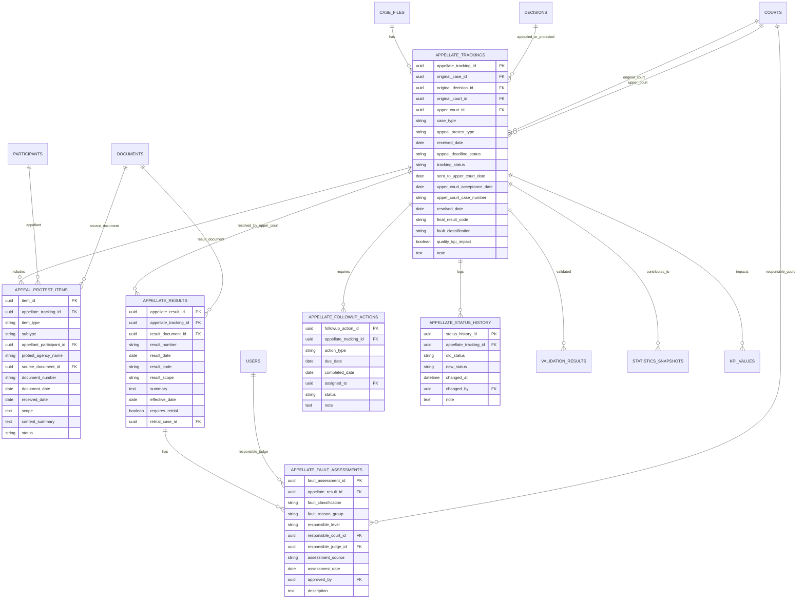

# DATABASE_DIAGRAM_APPEAL_PROTEST_TRACKING_V1.md

## 1. Đánh giá database hiện có

Database v1 trước đó đã có một số bảng phù hợp:

| Bảng hiện có | Có dùng được không | Vai trò |
|---|---:|---|
| `case_files` | Có | Vụ án/vụ việc gốc |
| `decisions` | Có | Bản án/quyết định bị kháng cáo/kháng nghị |
| `appeals` | Có nhưng chưa đủ | Mới chỉ ghi nhận kháng cáo cơ bản |
| `courts` | Có | Tòa án sơ thẩm và Tòa cấp trên |
| `participants` | Có | Người kháng cáo |
| `documents` | Có | Đơn kháng cáo, quyết định kháng nghị, bản án phúc thẩm |
| `case_assignments` | Có | Liên kết Thẩm phán/HĐXX sơ thẩm |
| `statistics_snapshots` | Có | Tổng hợp thống kê |
| `kpi_values` | Có | Dashboard chất lượng xét xử |
| `validation_results` | Có | Kiểm tra lỗi dữ liệu |

Tuy nhiên bảng `appeals` hiện tại chỉ phù hợp để ghi nhận đơn kháng cáo/kháng nghị đơn giản. Để theo dõi đầy đủ kết quả cấp trên, rút kháng cáo/kháng nghị, y án, hủy, sửa, lỗi khách quan/chủ quan, cần bổ sung module mới.

---

## 2. ERD tổng thể bổ sung



---

## 3. Module tối thiểu cần bổ sung

```text
Appeal/Protest Tracking Module
├── appellate_trackings
├── appeal_protest_items
├── appellate_results
├── appellate_fault_assessments
├── appellate_followup_actions
└── appellate_status_history
```

---

## 4. Liên kết với phân hệ phân công án ngẫu nhiên

Phân hệ phân công án cần tiêu chí:

```text
số vụ việc bị hủy, sửa do nguyên nhân chủ quan trong thời hạn 01 năm
```

Do đó module appellate phải cung cấp dữ liệu cho:

```text
judge_workload_snapshots.subjective_cancel_modify_count_1y
assignment_batch_judges.subjective_cancel_modify_count_1y
```

Nguồn tính:

```sql
count(appellate_fault_assessments)
where fault_classification = 'subjective'
and fault_reason_group is not null
and responsible_judge_id = judge_id
and assessment_date >= assignment_date - interval '1 year'
```

---

## 5. Liên kết với KPI Dashboard

Module này cung cấp các KPI:

```text
appeal_rate
protest_rate
appellate_resolved_count
upheld_rate
modified_rate
cancelled_rate
subjective_modified_cancelled_rate
objective_modified_cancelled_rate
withdrawn_appeal_protest_rate
upper_court_pending_cases
```

---

## 6. Liên kết với thống kê TAND

Cần bổ sung mapping vào `statistics_snapshots`:

| metric_code | Ý nghĩa |
|---|---|
| APPEALED_CASES | Số án bị kháng cáo |
| PROTESTED_CASES | Số án bị kháng nghị |
| APPELLATE_ACCEPTED | Số án đã được cấp trên thụ lý |
| APPELLATE_RESOLVED | Số án đã có kết quả cấp trên |
| APPELLATE_UPHELD | Y án |
| APPELLATE_MODIFIED | Sửa án |
| APPELLATE_CANCELLED | Hủy án |
| APPELLATE_WITHDRAWN | Rút kháng cáo/kháng nghị |
| CANCELLED_SUBJECTIVE | Hủy do lỗi chủ quan |
| MODIFIED_SUBJECTIVE | Sửa do lỗi chủ quan |
| CANCELLED_OBJECTIVE | Hủy do khách quan |
| MODIFIED_OBJECTIVE | Sửa do khách quan |

---

## 7. Kết luận đánh giá

Database hiện tại **cần bổ sung** module theo dõi kháng cáo/kháng nghị. Không nên chỉ mở rộng bảng `appeals` vì:

1. Một vụ án có thể có nhiều chủ thể kháng cáo/kháng nghị.
2. Cần theo dõi tiến trình chuyển cấp trên, thụ lý, giải quyết.
3. Cần phân biệt kết quả cuối cùng và từng văn bản/kết quả.
4. Cần phân loại hủy/sửa khách quan/chủ quan.
5. Cần gắn trách nhiệm với Thẩm phán/Tòa án để phục vụ KPI và phân công án ngẫu nhiên.
6. Cần lưu lịch sử trạng thái và hành động tiếp theo.

Sau khi bổ sung module này, database sẽ phù hợp để quản lý vòng đời án từ sơ thẩm đến kết quả cấp trên và đánh giá chất lượng xét xử.
