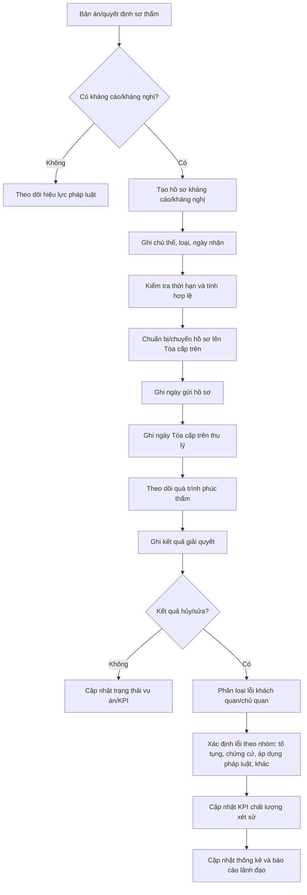

# SKILL_THEO_DOI_AN_KHANG_CAO_KHANG_NGHI_V1.md

## 1. Metadata

```yaml
skill_id: APPEAL_PROTEST_TRACKING_TAND
skill_name: Theo dõi án bị kháng cáo, kháng nghị lên Tòa án cấp trên
version: 1.0
project: TAND Quảng Ngãi - Hệ thống quản lý, thống kê và điều hành án
domain: Case Appeal/Protest Tracking
related_skills:
  - skill_blttds_v1
  - skill_bltths_v1
  - skill_ltthc_v1
  - skill_data_dictionary
  - skill_statistics_mapping
  - skill_kpi_dashboard
  - skill_validation_rules
```

---

## 2. Mục tiêu của skill

Skill này giúp AI và hệ thống phần mềm theo dõi toàn bộ vòng đời vụ án, vụ việc sau khi bản án/quyết định sơ thẩm bị kháng cáo hoặc kháng nghị lên Tòa án cấp trên.

Hệ thống cần trả lời được các câu hỏi:

1. Bản án/quyết định nào bị kháng cáo, kháng nghị?
2. Ai kháng cáo hoặc cơ quan nào kháng nghị?
3. Kháng cáo/kháng nghị thuộc loại nào?
4. Ngày nhận đơn, ngày gửi hồ sơ, ngày Tòa cấp trên thụ lý là ngày nào?
5. Tòa cấp trên đã giải quyết chưa?
6. Kết quả là rút kháng cáo/kháng nghị, y án, sửa án, hủy án hay đình chỉ?
7. Nếu hủy/sửa thì nguyên nhân là khách quan hay chủ quan?
8. Nếu chủ quan thì lỗi thuộc cá nhân, bộ phận hoặc cấp xét xử nào?
9. Số liệu này ảnh hưởng thế nào tới KPI, thống kê, đánh giá chất lượng xét xử và phân công án?

---

## 3. Phạm vi áp dụng

```yaml
applicable_case_types:
  civil:
    includes:
      - dân sự
      - hôn nhân gia đình
      - kinh doanh thương mại
      - lao động
      - việc dân sự có kháng cáo/kháng nghị theo thủ tục tương ứng
  criminal:
    includes:
      - hình sự sơ thẩm bị kháng cáo
      - hình sự sơ thẩm bị kháng nghị
      - kháng cáo của bị cáo, bị hại, đương sự
      - kháng nghị của Viện kiểm sát
  administrative:
    includes:
      - án hành chính sơ thẩm bị kháng cáo
      - án hành chính sơ thẩm bị kháng nghị
```

---

## 4. Khái niệm nghiệp vụ

### 4.1. Kháng cáo

Kháng cáo là việc chủ thể có quyền theo pháp luật tố tụng yêu cầu Tòa án cấp trên xem xét lại bản án, quyết định sơ thẩm chưa có hiệu lực pháp luật.

### 4.2. Kháng nghị

Kháng nghị là việc Viện kiểm sát hoặc chủ thể có thẩm quyền theo luật tố tụng yêu cầu Tòa án cấp trên xem xét lại bản án, quyết định theo thủ tục tương ứng.

### 4.3. Vụ án gốc

Là vụ án tại Tòa án cấp sơ thẩm nơi phát sinh bản án/quyết định bị kháng cáo, kháng nghị.

### 4.4. Hồ sơ phúc thẩm

Là hồ sơ được chuyển lên Tòa án cấp trên để giải quyết kháng cáo/kháng nghị.

### 4.5. Kết quả giải quyết của Tòa cấp trên

Các kết quả cần theo dõi tối thiểu:

```yaml
appellate_outcomes:
  - withdrawn_appeal
  - withdrawn_protest
  - uphold
  - modify
  - cancel
  - partial_cancel
  - terminate_appellate
  - suspend_appellate
  - remand_for_retrial
  - other
```

### 4.6. Nguyên nhân hủy/sửa

```yaml
fault_classification:
  objective:
    description: Nguyên nhân khách quan, không do lỗi chủ quan của Thẩm phán/HĐXX/Tòa án cấp dưới
  subjective:
    description: Nguyên nhân chủ quan, có lỗi nghiệp vụ, tố tụng, đánh giá chứng cứ, áp dụng pháp luật hoặc lỗi khác của Tòa án cấp dưới
  mixed:
    description: Có cả yếu tố khách quan và chủ quan
  unknown:
    description: Chưa phân loại hoặc chưa có kết luận
```

---

## 5. Quy trình nghiệp vụ tổng thể



---

## 6. Phân loại kháng cáo/kháng nghị

```yaml
appeal_protest_type:
  appeal:
    code: APPEAL
    description: Kháng cáo
    subtypes:
      - appeal_by_defendant
      - appeal_by_victim
      - appeal_by_plaintiff
      - appeal_by_defendant_civil
      - appeal_by_related_person
      - appeal_by_legal_representative
      - appeal_by_agency_or_organization
      - appeal_other
  protest:
    code: PROTEST
    description: Kháng nghị
    subtypes:
      - protest_by_same_level_procuracy
      - protest_by_upper_level_procuracy
      - protest_by_authorized_chief_judge
      - protest_other
```

---

## 7. Trạng thái hồ sơ kháng cáo/kháng nghị

```yaml
appeal_tracking_status:
  draft:
    description: Mới ghi nhận, chưa hoàn thiện dữ liệu
  received:
    description: Đã nhận đơn kháng cáo hoặc quyết định kháng nghị
  validated:
    description: Đã kiểm tra thông tin tối thiểu
  sent_to_upper_court:
    description: Đã chuyển hồ sơ lên Tòa án cấp trên
  accepted_by_upper_court:
    description: Tòa án cấp trên đã thụ lý
  in_appellate_review:
    description: Đang giải quyết tại cấp trên
  resolved:
    description: Đã có kết quả giải quyết
  returned_for_supplement:
    description: Hồ sơ bị yêu cầu bổ sung/trả lại
  closed:
    description: Đã kết thúc theo dõi
```

---

## 8. Kết quả giải quyết chuẩn hóa

```yaml
appellate_result_codes:
  WITHDRAWN_APPEAL:
    label: Rút kháng cáo
    impacts_quality_kpi: false
  WITHDRAWN_PROTEST:
    label: Rút kháng nghị
    impacts_quality_kpi: false
  UPHELD:
    label: Y án
    impacts_quality_kpi: false
  MODIFIED_OBJECTIVE:
    label: Sửa án do nguyên nhân khách quan
    impacts_quality_kpi: conditional
  MODIFIED_SUBJECTIVE:
    label: Sửa án do nguyên nhân chủ quan
    impacts_quality_kpi: true
  CANCELLED_OBJECTIVE:
    label: Hủy án do nguyên nhân khách quan
    impacts_quality_kpi: conditional
  CANCELLED_SUBJECTIVE:
    label: Hủy án do nguyên nhân chủ quan
    impacts_quality_kpi: true
  PARTIAL_CANCEL:
    label: Hủy một phần
    impacts_quality_kpi: true
  TERMINATED:
    label: Đình chỉ phúc thẩm
    impacts_quality_kpi: false
  SUSPENDED:
    label: Tạm đình chỉ phúc thẩm
    impacts_quality_kpi: false
  OTHER:
    label: Kết quả khác
    impacts_quality_kpi: review_required
```

---

## 9. Nhóm lỗi khi án bị hủy/sửa

```yaml
fault_reason_groups:
  procedural_error:
    label: Vi phạm thủ tục tố tụng
    examples:
      - xác định sai tư cách tham gia tố tụng
      - thiếu người tham gia tố tụng
      - vi phạm thẩm quyền
      - vi phạm thành phần Hội đồng xét xử
      - vi phạm thời hạn/tống đạt/giao nhận
  evidence_error:
    label: Sai sót trong thu thập, đánh giá chứng cứ
    examples:
      - thu thập chứng cứ chưa đầy đủ
      - đánh giá chứng cứ không khách quan
      - bỏ sót tài liệu quan trọng
  legal_application_error:
    label: Áp dụng pháp luật không đúng
    examples:
      - áp dụng sai điều luật
      - xác định sai quan hệ pháp luật
      - xác định sai tội danh/khung hình phạt
      - xác định sai thời hiệu/thẩm quyền
  judgment_reasoning_error:
    label: Nhận định, lập luận bản án không đầy đủ hoặc mâu thuẫn
  sentencing_error:
    label: Sai sót về hình phạt, trách nhiệm dân sự, án phí
  objective_new_facts:
    label: Tình tiết khách quan mới phát sinh hoặc mới được cung cấp
  other:
    label: Lý do khác
```

---

## 10. Data Dictionary

### 10.1. appellate_trackings

| Field | Type | Required | Description |
|---|---|---:|---|
| appellate_tracking_id | UUID | Yes | Mã hồ sơ theo dõi kháng cáo/kháng nghị |
| original_case_id | UUID | Yes | Vụ án/vụ việc gốc tại cấp sơ thẩm |
| original_decision_id | UUID | Yes | Bản án/quyết định bị kháng cáo/kháng nghị |
| original_court_id | UUID | Yes | Tòa án cấp sơ thẩm |
| upper_court_id | UUID | No | Tòa án cấp trên giải quyết |
| case_type | string | Yes | Dân sự/hình sự/hành chính... |
| appeal_protest_type | enum | Yes | APPEAL/PROTEST/BOTH |
| received_date | date | Yes | Ngày Tòa án cấp sơ thẩm nhận kháng cáo/kháng nghị |
| appeal_deadline_status | enum | No | Trong hạn/quá hạn/chờ xem xét |
| tracking_status | enum | Yes | Trạng thái theo dõi |
| sent_to_upper_court_date | date | No | Ngày chuyển hồ sơ lên cấp trên |
| upper_court_acceptance_date | date | No | Ngày Tòa cấp trên thụ lý |
| upper_court_case_number | string | No | Số thụ lý phúc thẩm/cấp trên |
| resolved_date | date | No | Ngày có kết quả giải quyết |
| final_result_code | enum | No | Kết quả cuối cùng |
| fault_classification | enum | No | Khách quan/chủ quan/hỗn hợp/chưa rõ |
| quality_kpi_impact | boolean | No | Có tính vào KPI hủy/sửa do lỗi chủ quan không |
| note | text | No | Ghi chú |

### 10.2. appeal_protest_items

| Field | Type | Required | Description |
|---|---|---:|---|
| item_id | UUID | Yes | Mã từng đơn kháng cáo/quyết định kháng nghị |
| appellate_tracking_id | UUID | Yes | Hồ sơ theo dõi |
| item_type | enum | Yes | APPEAL/PROTEST |
| subtype | string | No | Loại chi tiết |
| appellant_participant_id | UUID | No | Người kháng cáo |
| protest_agency_name | string | No | Cơ quan kháng nghị |
| document_number | string | No | Số đơn/quyết định |
| document_date | date | No | Ngày văn bản |
| received_date | date | Yes | Ngày nhận |
| scope | text | No | Phạm vi kháng cáo/kháng nghị |
| content_summary | text | No | Tóm tắt nội dung |
| status | enum | Yes | active/withdrawn/rejected/accepted |

### 10.3. appellate_results

| Field | Type | Required | Description |
|---|---|---:|---|
| appellate_result_id | UUID | Yes | Mã kết quả |
| appellate_tracking_id | UUID | Yes | Hồ sơ theo dõi |
| result_document_id | UUID | No | Văn bản kết quả của cấp trên |
| result_number | string | No | Số bản án/quyết định phúc thẩm |
| result_date | date | Yes | Ngày ban hành |
| result_code | enum | Yes | Y án/sửa/hủy/rút... |
| result_scope | string | No | Toàn bộ/một phần |
| summary | text | No | Tóm tắt kết quả |
| effective_date | date | No | Ngày có hiệu lực |
| requires_retrial | boolean | No | Có phải xét xử lại không |
| retrial_case_id | UUID | No | Vụ án xét xử lại nếu có |

### 10.4. appellate_fault_assessments

| Field | Type | Required | Description |
|---|---|---:|---|
| fault_assessment_id | UUID | Yes | Mã đánh giá lỗi |
| appellate_result_id | UUID | Yes | Kết quả cấp trên |
| fault_classification | enum | Yes | objective/subjective/mixed/unknown |
| fault_reason_group | enum | No | Nhóm lỗi |
| responsible_level | enum | No | sơ thẩm/phúc thẩm/khác |
| responsible_court_id | UUID | No | Tòa án được xác định có lỗi |
| responsible_judge_id | UUID | No | Thẩm phán nếu xác định được |
| assessment_source | string | No | Bản án cấp trên/họp rút kinh nghiệm/kết luận kiểm tra |
| assessment_date | date | No | Ngày đánh giá |
| approved_by | UUID | No | Người phê duyệt phân loại |
| description | text | No | Mô tả lý do |

### 10.5. appellate_followup_actions

| Field | Type | Required | Description |
|---|---|---:|---|
| followup_action_id | UUID | Yes | Mã hành động tiếp theo |
| appellate_tracking_id | UUID | Yes | Hồ sơ theo dõi |
| action_type | enum | Yes | retrial/re_experience_report/kpi_update/statistics_update/discipline_review/other |
| due_date | date | No | Hạn thực hiện |
| completed_date | date | No | Ngày hoàn thành |
| assigned_to | UUID | No | Người được giao xử lý |
| status | enum | Yes | pending/in_progress/completed/cancelled |
| note | text | No | Ghi chú |

---

## 11. Quy tắc validation

```yaml
validation_rules:
  AP001_REQUIRED_ORIGINAL_DECISION:
    severity: ERROR
    condition: original_decision_id is null
    message: Phải xác định bản án/quyết định bị kháng cáo hoặc kháng nghị.

  AP002_REQUIRED_RECEIVED_DATE:
    severity: ERROR
    condition: received_date is null
    message: Phải nhập ngày nhận kháng cáo/kháng nghị.

  AP003_UPPER_ACCEPTANCE_AFTER_SENT:
    severity: ERROR
    condition: upper_court_acceptance_date < sent_to_upper_court_date
    message: Ngày Tòa cấp trên thụ lý không được trước ngày chuyển hồ sơ.

  AP004_RESOLVED_AFTER_ACCEPTANCE:
    severity: ERROR
    condition: resolved_date < upper_court_acceptance_date
    message: Ngày giải quyết không được trước ngày Tòa cấp trên thụ lý.

  AP005_RESULT_REQUIRED_WHEN_RESOLVED:
    severity: ERROR
    condition: tracking_status == 'resolved' and final_result_code is null
    message: Hồ sơ đã giải quyết phải có kết quả cấp trên.

  AP006_FAULT_REQUIRED_FOR_CANCEL_MODIFY:
    severity: ERROR
    condition: final_result_code in ['MODIFIED_OBJECTIVE','MODIFIED_SUBJECTIVE','CANCELLED_OBJECTIVE','CANCELLED_SUBJECTIVE','PARTIAL_CANCEL'] and fault_classification is null
    message: Án bị hủy/sửa phải phân loại nguyên nhân khách quan/chủ quan.

  AP007_SUBJECTIVE_FAULT_NEEDS_REASON:
    severity: ERROR
    condition: fault_classification == 'subjective' and fault_reason_group is null
    message: Hủy/sửa do lỗi chủ quan phải xác định nhóm lỗi.

  AP008_WITHDRAWN_ITEM_STATUS:
    severity: WARNING
    condition: final_result_code in ['WITHDRAWN_APPEAL','WITHDRAWN_PROTEST'] and no appeal_protest_item.status == 'withdrawn'
    message: Kết quả rút kháng cáo/kháng nghị nên có ít nhất một item được ghi nhận là đã rút.

  AP009_KPI_IMPACT_REQUIRED:
    severity: WARNING
    condition: final_result_code contains subjective and quality_kpi_impact is null
    message: Cần xác định có tính vào KPI chất lượng xét xử hay không.

  AP010_RETRIAL_REQUIRED_FOR_CANCEL:
    severity: WARNING
    condition: final_result_code contains 'CANCEL' and requires_retrial is null
    message: Án bị hủy cần xác định có phải xét xử lại hay không.
```

---

## 12. KPI và báo cáo

### 12.1. KPI đề xuất

```yaml
kpi_metrics:
  appeal_rate:
    formula: appealed_cases / resolved_first_instance_cases
    description: Tỷ lệ án bị kháng cáo/kháng nghị

  upheld_rate:
    formula: upheld_cases / appellate_resolved_cases
    description: Tỷ lệ y án

  modified_rate:
    formula: modified_cases / appellate_resolved_cases
    description: Tỷ lệ sửa án

  cancelled_rate:
    formula: cancelled_cases / appellate_resolved_cases
    description: Tỷ lệ hủy án

  subjective_modified_cancelled_rate:
    formula: subjective_modified_cancelled_cases / appellate_resolved_cases
    description: Tỷ lệ hủy/sửa do lỗi chủ quan

  objective_modified_cancelled_rate:
    formula: objective_modified_cancelled_cases / appellate_resolved_cases
    description: Tỷ lệ hủy/sửa do nguyên nhân khách quan

  withdrawn_appeal_protest_rate:
    formula: withdrawn_appeal_protest_cases / appellate_resolved_cases
    description: Tỷ lệ rút kháng cáo/kháng nghị

  upper_court_pending_cases:
    formula: count(tracking_status in ['sent_to_upper_court','accepted_by_upper_court','in_appellate_review'])
    description: Số hồ sơ đang chờ kết quả cấp trên
```

### 12.2. Báo cáo lãnh đạo cần có

```yaml
leadership_reports:
  - danh sách án đã bị kháng cáo/kháng nghị trong kỳ
  - danh sách án đã chuyển cấp trên nhưng chưa có kết quả
  - danh sách án đã có kết quả cấp trên
  - danh sách án bị hủy/sửa
  - danh sách án hủy/sửa do lỗi chủ quan theo Thẩm phán
  - tỷ lệ y án/sửa/hủy theo từng loại án
  - tỷ lệ kháng cáo/kháng nghị theo Tòa án cấp huyện/khu vực
  - cảnh báo hồ sơ chưa cập nhật kết quả cấp trên
```

---

## 13. AI Reasoning Prompt Templates

### 13.1. Kiểm tra hồ sơ kháng cáo/kháng nghị

```text
Bạn là AI kiểm tra dữ liệu theo dõi án kháng cáo/kháng nghị.
Hãy kiểm tra hồ sơ {appellate_tracking_id}.
Đối chiếu các trường:
- vụ án gốc;
- bản án/quyết định bị kháng cáo/kháng nghị;
- chủ thể kháng cáo/kháng nghị;
- ngày nhận;
- ngày chuyển cấp trên;
- ngày Tòa cấp trên thụ lý;
- kết quả cấp trên;
- phân loại lỗi khách quan/chủ quan nếu hủy/sửa.
Trả về danh sách lỗi dữ liệu, cảnh báo và đề xuất cập nhật.
```

### 13.2. Giải thích án bị hủy/sửa

```text
Hãy giải thích vì sao vụ án {case_id} được ghi nhận là {final_result_code}.
Cần nêu:
- kết quả của Tòa án cấp trên;
- phạm vi hủy/sửa;
- nguyên nhân khách quan/chủ quan;
- nhóm lỗi;
- có ảnh hưởng KPI chất lượng xét xử hay không;
- Thẩm phán hoặc đơn vị liên quan nếu dữ liệu có.
```

---

## 14. Nguyên tắc thiết kế quan trọng

1. Không ghi đè kết quả sơ thẩm trong `case_files`; phải lưu lịch sử ở module appellate.
2. Mỗi vụ án có thể có nhiều đơn kháng cáo/kháng nghị, nên cần bảng `appeal_protest_items`.
3. Một hồ sơ kháng cáo/kháng nghị có thể có một hoặc nhiều kết quả/cập nhật, nhưng kết quả cuối cùng phải được chuẩn hóa ở `appellate_trackings.final_result_code`.
4. Hủy/sửa phải có bảng đánh giá nguyên nhân riêng để phục vụ KPI chất lượng xét xử.
5. Phải tách nguyên nhân khách quan/chủ quan để tránh đánh giá sai trách nhiệm Thẩm phán.
6. Cần liên kết với phân hệ phân công án để thống kê số án bị hủy/sửa do lỗi chủ quan trong 01 năm của từng Thẩm phán.
7. Cần liên kết với dashboard KPI để lãnh đạo theo dõi chất lượng xét xử theo thời gian thực.
