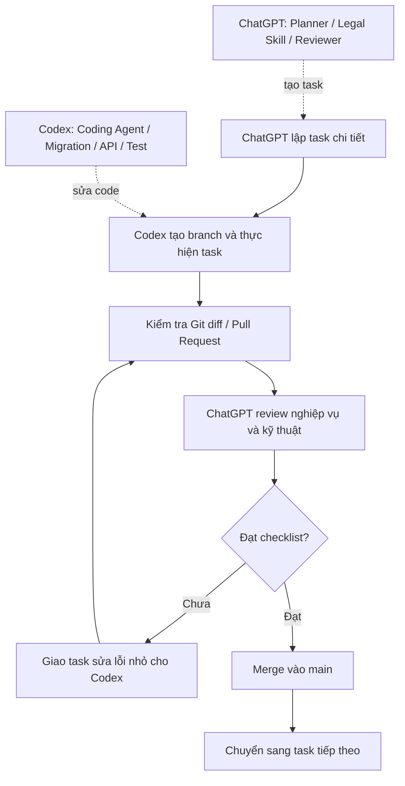

# Infographic - Quy trình làm việc ChatGPT + Codex

## Nguyên tắc gốc

```text
Một task nhỏ → Một branch → Một PR → Review → Sửa → Merge → Task tiếp theo
```

## Sơ đồ Mermaid



## Checklist trước khi merge

- Đúng phạm vi task.
- Không tự mở rộng chức năng.
- Không đổi schema lõi nếu không có migration.
- Có validation nếu có logic nghiệp vụ.
- Có test hoặc checklist kiểm tra.
- Không xóa audit log.
- Không ghi đè lịch sử vụ án.
- Không tự kết luận lỗi chủ quan khi chưa có căn cứ.
- Không làm dashboard/KPI bị đếm trùng.
- Có cập nhật README/docs nếu cần.

## Cách chia task

### Nhóm A - Nền dự án

```text
Task 01: Tạo cấu trúc thư mục repo
Task 02: Thêm AGENTS.md
Task 03: Thêm knowledge_base
Task 04: Thêm README tổng quan
```

### Nhóm B - Database

```text
Task 05: Tạo core database schema
Task 06: Tạo specialized case schema
Task 07: Tạo random assignment schema
Task 08: Tạo appeal/protest tracking schema
Task 09: Tạo statistics/KPI schema
Task 10: Tạo seed data danh mục ban đầu
```

### Nhóm C - Backend

```text
Task 11: Tạo backend project structure
Task 12: Tạo database connection
Task 13: Tạo module courts/users
Task 14: Tạo module case_files
Task 15: Tạo module random_assignment
Task 16: Tạo module appellate_tracking
Task 17: Tạo module validation_results
```

### Nhóm D - Frontend

```text
Task 18: Tạo frontend project structure
Task 19: Tạo màn hình danh sách vụ án
Task 20: Tạo màn hình nhập/sửa hồ sơ
Task 21: Tạo màn hình phân công án
Task 22: Tạo màn hình kháng cáo/kháng nghị
Task 23: Tạo dashboard lãnh đạo
```

### Nhóm E - Test, báo cáo, tài liệu

```text
Task 24: Viết test database
Task 25: Viết test API
Task 26: Viết test random_assignment
Task 27: Viết test appeal_tracking
Task 28: Viết tài liệu cài đặt
Task 29: Viết hướng dẫn sử dụng
```

## Mẫu task chuẩn

```yaml
Task:
Objective:
Input:
Output:
Dependencies:
Validation:
Owner Agent:
Priority:
```

## Ghi nhớ

```text
ChatGPT nghĩ và kiểm tra.
Codex code.
Mỗi lần chỉ một việc.
```
