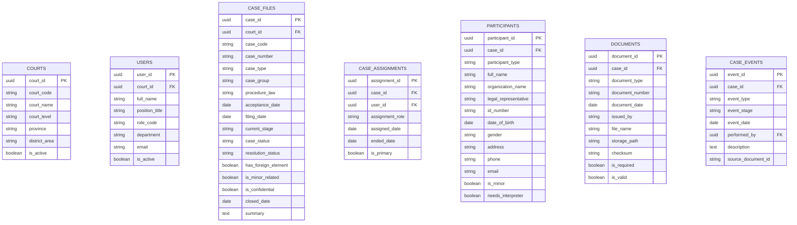
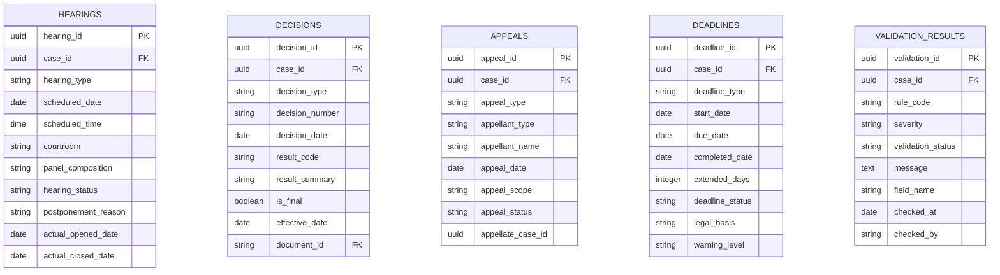
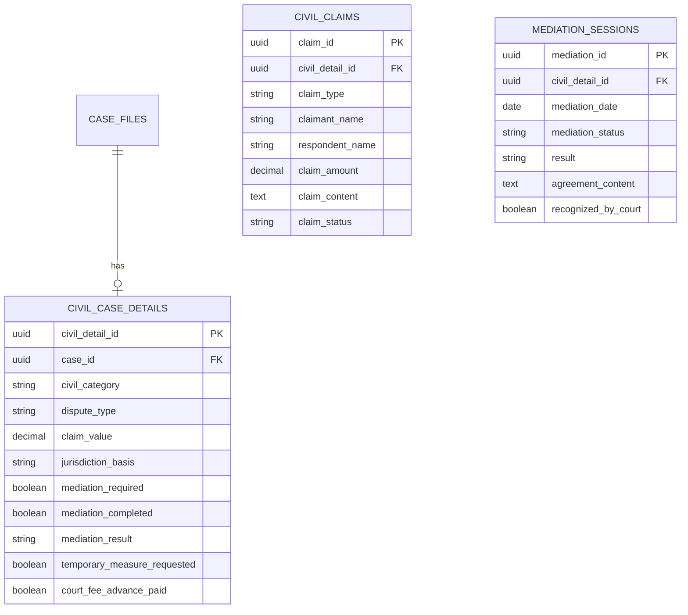
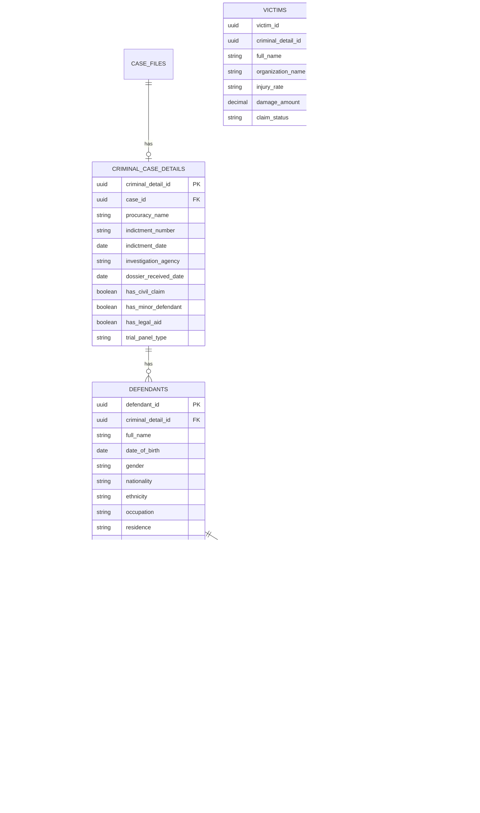
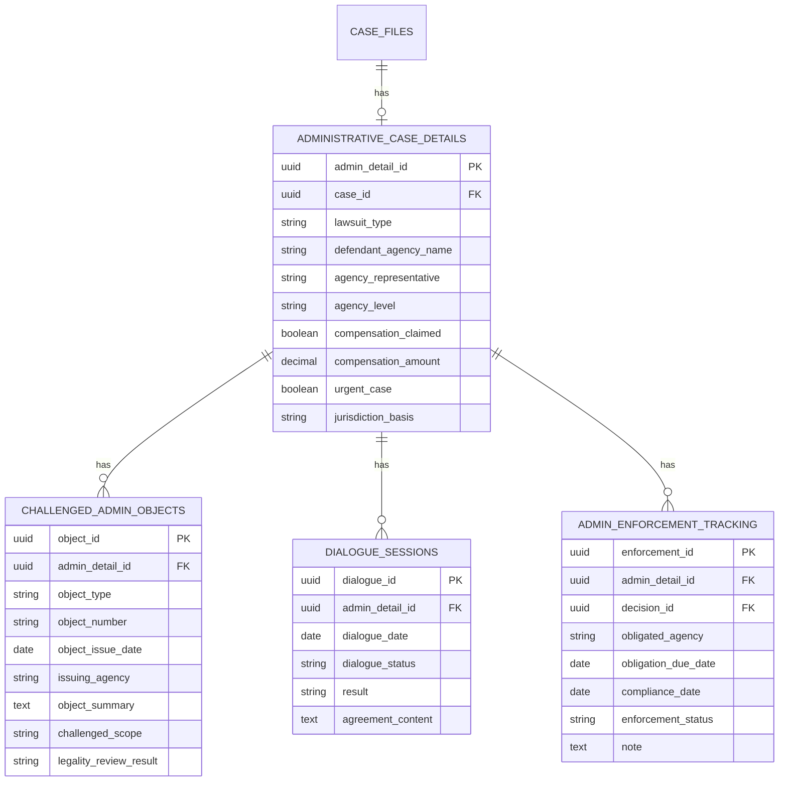
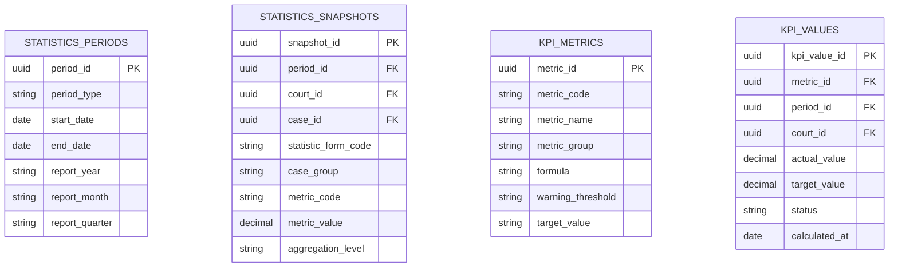

# DATABASE DIAGRAM - Hệ thống quản lý Tòa án Quảng Ngãi

## 1. Tư duy thiết kế cơ sở dữ liệu

Hệ thống nên thiết kế theo mô hình **Core Case Management + Specialized Case Modules**.

- `courts`, `users`, `case_files`, `participants`, `documents`, `hearings`, `decisions`, `appeals`, `deadlines`, `statistics_snapshots` là lõi chung.
- `civil_case_details` mở rộng cho dân sự, hôn nhân gia đình, kinh doanh thương mại, lao động, việc dân sự.
- `criminal_case_details`, `defendants`, `charges`, `preventive_measures`, `sentences` mở rộng cho án hình sự.
- `administrative_case_details`, `challenged_admin_objects`, `dialogue_sessions` mở rộng cho án hành chính.
- `case_events` là nhật ký nghiệp vụ để theo dõi toàn bộ vòng đời hồ sơ.
- `validation_results` dùng cho AI/rule engine kiểm tra thiếu dữ liệu, quá hạn, sai logic.
- `kpi_metrics` và `statistics_snapshots` phục vụ dashboard lãnh đạo.

---

## 2. Sơ đồ ERD tổng thể

```mermaid
erDiagram

    COURTS ||--o{ USERS : employs
    COURTS ||--o{ CASE_FILES : manages
    USERS ||--o{ CASE_ASSIGNMENTS : assigned
    CASE_FILES ||--o{ CASE_ASSIGNMENTS : has
    CASE_FILES ||--o{ PARTICIPANTS : has
    CASE_FILES ||--o{ CASE_EVENTS : logs
    CASE_FILES ||--o{ DOCUMENTS : stores
    CASE_FILES ||--o{ HEARINGS : schedules
    CASE_FILES ||--o{ DECISIONS : issues
    CASE_FILES ||--o{ APPEALS : may_have
    CASE_FILES ||--o{ DEADLINES : tracks
    CASE_FILES ||--o{ VALIDATION_RESULTS : checked_by_ai
    CASE_FILES ||--o{ STATISTICS_SNAPSHOTS : contributes_to

    CASE_FILES ||--o| CIVIL_CASE_DETAILS : civil_extension
    CASE_FILES ||--o| CRIMINAL_CASE_DETAILS : criminal_extension
    CASE_FILES ||--o| ADMINISTRATIVE_CASE_DETAILS : administrative_extension

    CIVIL_CASE_DETAILS ||--o{ CIVIL_CLAIMS : includes
    CIVIL_CASE_DETAILS ||--o{ MEDIATION_SESSIONS : has

    CRIMINAL_CASE_DETAILS ||--o{ DEFENDANTS : has
    DEFENDANTS ||--o{ CHARGES : accused_of
    DEFENDANTS ||--o{ PREVENTIVE_MEASURES : subject_to
    DEFENDANTS ||--o{ SENTENCES : receives
    CRIMINAL_CASE_DETAILS ||--o{ VICTIMS : has
    CRIMINAL_CASE_DETAILS ||--o{ INVESTIGATION_RETURNS : may_return

    ADMINISTRATIVE_CASE_DETAILS ||--o{ CHALLENGED_ADMIN_OBJECTS : challenges
    ADMINISTRATIVE_CASE_DETAILS ||--o{ DIALOGUE_SESSIONS : has
    ADMINISTRATIVE_CASE_DETAILS ||--o{ ADMIN_ENFORCEMENT_TRACKING : tracks

    STATISTICS_PERIODS ||--o{ STATISTICS_SNAPSHOTS : contains
    KPI_METRICS ||--o{ KPI_VALUES : defines
    STATISTICS_PERIODS ||--o{ KPI_VALUES : measured_in
    COURTS ||--o{ KPI_VALUES : reported_by
```



---

## 3. Nhóm bảng lõi dùng chung



### Ý nghĩa nhóm lõi

Nhóm này giúp quản lý thống nhất mọi hồ sơ, bất kể là dân sự, hình sự hay hành chính. `case_files` là bảng trung tâm. Mọi bảng nghiệp vụ khác đều xoay quanh `case_id`.

---

## 4. Nhóm bảng tiến trình, phiên tòa, quyết định



---

## 5. Module dân sự, hôn nhân gia đình, kinh doanh thương mại, lao động



### Trường nhập liệu quan trọng cho án dân sự

| Nhóm | Trường |
|---|---|
| Loại án | `civil_category`, `dispute_type` |
| Đương sự | nguyên đơn, bị đơn, người liên quan |
| Giá trị tranh chấp | `claim_value`, `claim_amount` |
| Hòa giải | `mediation_required`, `mediation_result` |
| Án phí | `court_fee_advance_paid` |
| Biện pháp khẩn cấp | `temporary_measure_requested` |
| Kết quả | công nhận thỏa thuận, đình chỉ, xét xử, bác/nhận yêu cầu |

---

## 6. Module hình sự



### Trường nhập liệu quan trọng cho án hình sự

| Nhóm | Trường |
|---|---|
| Cáo trạng | `indictment_number`, `indictment_date`, `procuracy_name` |
| Bị cáo | họ tên, năm sinh, nơi cư trú, tiền án, tình trạng tạm giam |
| Tội danh | `crime_name`, `penal_code_article`, `clause_point` |
| Biện pháp ngăn chặn | `measure_type`, `start_date`, `end_date` |
| Trả hồ sơ | `return_reason`, `return_date` |
| Kết quả xét xử | hình phạt chính, án treo, phạt tiền, trách nhiệm dân sự |
| Cảnh báo | quá hạn tạm giam, quá hạn chuẩn bị xét xử, thiếu điều luật truy tố |

---

## 7. Module hành chính



### Trường nhập liệu quan trọng cho án hành chính

| Nhóm | Trường |
|---|---|
| Đối tượng kiện | quyết định hành chính, hành vi hành chính, kỷ luật buộc thôi việc, danh sách cử tri |
| Người bị kiện | `defendant_agency_name`, `agency_representative`, `agency_level` |
| Quyết định bị kiện | số, ngày, cơ quan ban hành, phạm vi bị kiện |
| Bồi thường | `compensation_claimed`, `compensation_amount` |
| Đối thoại | `dialogue_status`, `result` |
| Thi hành án hành chính | cơ quan phải thi hành, hạn thi hành, trạng thái thi hành |

---

## 8. Module thống kê, KPI, dashboard



### KPI lãnh đạo nên có

| KPI | Ý nghĩa |
|---|---|
| `total_accepted_cases` | Tổng thụ lý |
| `resolved_cases` | Đã giải quyết |
| `pending_cases` | Còn tồn |
| `overdue_cases` | Quá hạn |
| `clearance_rate` | Tỷ lệ giải quyết |
| `appeal_rate` | Tỷ lệ kháng cáo |
| `modified_cancelled_rate` | Tỷ lệ án bị sửa/hủy |
| `mediation_success_rate` | Tỷ lệ hòa giải/đối thoại thành |
| `returned_investigation_rate` | Tỷ lệ trả hồ sơ điều tra bổ sung |
| `detention_deadline_warning` | Cảnh báo hạn tạm giam |

---

## 9. Gợi ý triển khai PostgreSQL schema

```sql
CREATE TYPE case_type_enum AS ENUM (
    'civil',
    'marriage_family',
    'business_commercial',
    'labor',
    'criminal',
    'administrative',
    'civil_matter'
);

CREATE TYPE case_status_enum AS ENUM (
    'draft',
    'received',
    'accepted',
    'preparing',
    'trial_scheduled',
    'resolved',
    'appealed',
    'effective',
    'temporarily_suspended',
    'suspended',
    'overdue'
);
```

### Bảng trung tâm

```sql
CREATE TABLE case_files (
    case_id UUID PRIMARY KEY,
    court_id UUID NOT NULL,
    case_code VARCHAR(100) UNIQUE,
    case_number VARCHAR(100),
    case_type case_type_enum NOT NULL,
    case_group VARCHAR(100),
    procedure_law VARCHAR(50),
    filing_date DATE,
    acceptance_date DATE,
    current_stage VARCHAR(100),
    case_status case_status_enum,
    resolution_status VARCHAR(100),
    has_foreign_element BOOLEAN DEFAULT FALSE,
    is_minor_related BOOLEAN DEFAULT FALSE,
    is_confidential BOOLEAN DEFAULT FALSE,
    closed_date DATE,
    summary TEXT,
    created_at TIMESTAMP DEFAULT CURRENT_TIMESTAMP,
    updated_at TIMESTAMP DEFAULT CURRENT_TIMESTAMP
);
```

---

## 10. Quy tắc thiết kế quan trọng

### 10.1. Không tạo một bảng riêng cho từng loại tranh chấp nhỏ

Không nên tạo các bảng như:

- `divorce_cases`
- `land_dispute_cases`
- `contract_dispute_cases`
- `inheritance_cases`

Thay vào đó, dùng:

- `case_files.case_type`
- `civil_case_details.civil_category`
- `civil_case_details.dispute_type`
- bảng danh mục `dm_dispute_types`

### 10.2. Dữ liệu thống kê nên tách khỏi dữ liệu hồ sơ

Không nên tính báo cáo trực tiếp từ bảng hồ sơ mỗi lần mở dashboard. Nên có bảng:

- `statistics_snapshots`
- `kpi_values`

để lưu số liệu đã tổng hợp theo tháng, quý, năm.

### 10.3. AI không ghi trực tiếp vào bảng chính

AI nên ghi vào:

- `validation_results`
- `ai_suggestions`
- `case_risk_flags`

Sau đó người dùng xác nhận mới cập nhật dữ liệu chính.

---

## 11. Phiên bản mở rộng đề xuất

Ở giai đoạn sau có thể bổ sung:

```text
ai_suggestions
case_risk_flags
legal_basis_references
statistical_form_definitions
statistical_form_items
audit_logs
sync_jobs
document_ocr_results
notification_queue
```

---

## 12. Kết luận thiết kế

Mô hình cơ sở dữ liệu đề xuất có 05 lớp:

```text
1. Master Data
   courts, users, categories

2. Case Core
   case_files, participants, documents, hearings, decisions

3. Specialized Modules
   civil_case_details, criminal_case_details, administrative_case_details

4. Rule/AI Layer
   deadlines, validation_results, ai_suggestions, risk_flags

5. Analytics Layer
   statistics_snapshots, kpi_metrics, kpi_values
```

Đây là cấu trúc phù hợp để phát triển hệ thống quản lý, thống kê, giám sát và điều hành hoạt động Tòa án hai cấp tỉnh Quảng Ngãi.
