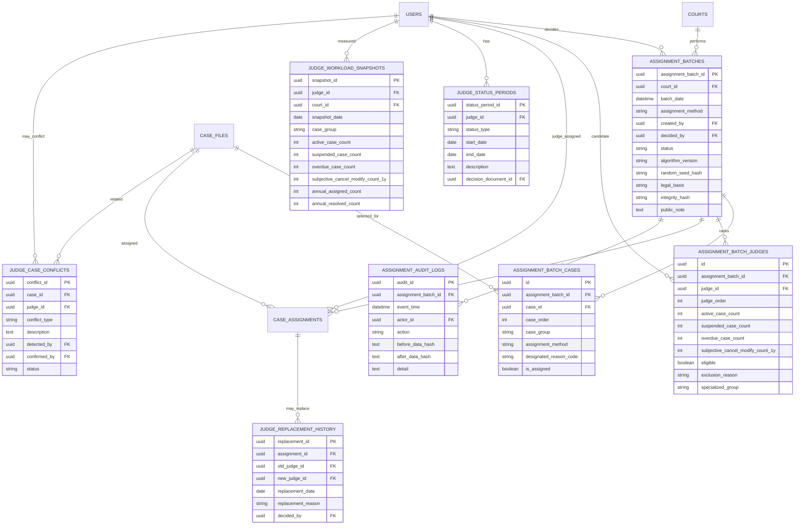

# ĐÁNH GIÁ DATABASE HIỆN CÓ ĐỐI VỚI PHÂN HỆ PHÂN CÔNG ÁN NGẪU NHIÊN

## 1. Kết luận nhanh

Database diagram đã xây dựng trước đó **phù hợp ở mức nền tảng**, vì đã có các bảng lõi:

- `courts`
- `users`
- `case_files`
- `case_assignments`
- `case_events`
- `deadlines`
- `validation_results`
- `documents`
- `statistics_snapshots`
- `kpi_values`

Tuy nhiên, để áp dụng đầy đủ Thông tư 01/2022/TT-TANDTC cho phân công án ngẫu nhiên, database hiện tại **chưa đủ**. Cần bổ sung một phân hệ riêng để quản lý:

1. Phiên phân công án.
2. Danh sách vụ việc tại thời điểm phân công.
3. Danh sách Thẩm phán tại thời điểm phân công.
4. Tình trạng không được phân công của Thẩm phán.
5. Xung đột/từ chối/thay đổi Thẩm phán theo từng vụ việc.
6. Chỉ tiêu, tải việc, tạm đình chỉ, quá hạn, hủy/sửa chủ quan.
7. Audit log/hash để bảo đảm không can thiệp kết quả.

---

## 2. Bảng hiện tại có thể dùng lại

| Bảng hiện tại | Mức độ phù hợp | Ghi chú |
|---|---:|---|
| `courts` | Cao | Xác định Tòa án thực hiện phân công |
| `users` | Trung bình | Có thể lưu Thẩm phán nhưng cần bổ sung hồ sơ Thẩm phán chuyên sâu |
| `case_files` | Cao | Là nguồn danh sách vụ việc đã thụ lý |
| `case_assignments` | Trung bình | Có thể ghi kết quả phân công, nhưng thiếu batch, method, audit, reason |
| `case_events` | Trung bình | Ghi nhật ký nghiệp vụ nhưng chưa đủ tính bất biến cho phân công |
| `deadlines` | Trung bình | Dùng để tính vụ quá hạn luật định |
| `validation_results` | Cao | Dùng cho AI/rule engine kiểm tra tính hợp lệ phân công |
| `documents` | Trung bình | Lưu quyết định phân công, quyết định cử đi học, nghỉ, kỷ luật |
| `statistics_snapshots` | Thấp-Trung bình | Có thể phục vụ KPI nhưng không thay thế workload snapshot |

---

## 3. Các thiếu hụt chính

### 3.1. Thiếu phiên phân công

Hiện chưa có bảng để lưu một lần phân công án gồm:

- ngày giờ phân công;
- danh sách vụ việc;
- danh sách Thẩm phán;
- phương thức phân công;
- thuật toán;
- người quyết định;
- hash/audit.

Cần bổ sung:

```text
assignment_batches
assignment_batch_cases
assignment_batch_judges
```

---

### 3.2. Thiếu trạng thái vắng mặt/không đủ điều kiện của Thẩm phán

Thông tư yêu cầu loại trừ Thẩm phán đang:

- biệt phái, công tác, đào tạo, bồi dưỡng, tập huấn từ 01 tháng trở lên;
- nghỉ phép, nghỉ thai sản, nghỉ điều trị bệnh;
- bị kỷ luật, chờ kỷ luật, tạm dừng phân công;
- không thể thực hiện nhiệm vụ vì lý do khác.

Cần bổ sung:

```text
judge_status_periods
judge_assignment_eligibility
```

---

### 3.3. Thiếu xung đột theo vụ việc cụ thể

Thông tư quy định nếu Thẩm phán thuộc trường hợp phải từ chối hoặc bị thay đổi đối với vụ việc cụ thể thì không được phân công vụ đó.

Cần bổ sung:

```text
judge_case_conflicts
judge_replacement_history
```

---

### 3.4. Thiếu snapshot tải việc tại thời điểm phân công

Điều 7 và Điều 9 yêu cầu sắp xếp Thẩm phán theo:

1. số vụ đang giải quyết;
2. số vụ đang tạm đình chỉ;
3. số vụ quá hạn luật định;
4. số vụ bị hủy, sửa do nguyên nhân chủ quan trong 01 năm;
5. tên theo bảng chữ cái tiếng Việt.

Các số liệu này phải được lưu lại tại thời điểm phân công, không chỉ tính động.

Cần bổ sung:

```text
judge_workload_snapshots
judge_performance_metrics
```

---

### 3.5. Thiếu phân quyền Chánh án/Phó Chánh án được ủy quyền

Thông tư cho phép Chánh án ủy quyền Phó Chánh án thực hiện phân công nhưng Chánh án vẫn kiểm tra, giám sát và chịu trách nhiệm.

Cần bổ sung hoặc mở rộng:

```text
assignment_authorizations
users.role_code
users.position_title
```

---

### 3.6. Thiếu audit log chuyên biệt

`case_events` có thể ghi sự kiện, nhưng phân công án cần audit riêng để chứng minh:

- danh sách đầu vào không bị sửa;
- thuật toán đã chạy đúng;
- kết quả không bị can thiệp;
- ai quyết định;
- khi nào công khai.

Cần bổ sung:

```text
assignment_audit_logs
assignment_integrity_hashes
```

---

## 4. Đề xuất bổ sung database



---

## 5. Mở rộng bảng `case_assignments`

Bảng hiện tại nên bổ sung các cột:

```sql
ALTER TABLE case_assignments
ADD COLUMN assignment_batch_id UUID,
ADD COLUMN assignment_method VARCHAR(30),
ADD COLUMN assigned_by UUID,
ADD COLUMN legal_basis TEXT,
ADD COLUMN designated_reason_code VARCHAR(100),
ADD COLUMN judge_rank_at_assignment INTEGER,
ADD COLUMN case_order_at_assignment INTEGER,
ADD COLUMN integrity_hash TEXT,
ADD COLUMN status VARCHAR(30) DEFAULT 'active',
ADD COLUMN replacement_reason TEXT;
```

---

## 6. Mở rộng bảng `users`

Bảng `users` hiện có thể dùng cho Thẩm phán, nhưng nên bổ sung:

```sql
ALTER TABLE users
ADD COLUMN is_judge BOOLEAN DEFAULT FALSE,
ADD COLUMN judge_rank VARCHAR(100),
ADD COLUMN specialized_court_code VARCHAR(100),
ADD COLUMN specialized_group VARCHAR(100),
ADD COLUMN is_leadership BOOLEAN DEFAULT FALSE,
ADD COLUMN leadership_quota NUMERIC(5,2),
ADD COLUMN maternity_quota_status BOOLEAN DEFAULT FALSE,
ADD COLUMN annual_assignment_quota INTEGER;
```

Tốt hơn là tạo bảng riêng:

```text
judge_profiles
```

để không làm bảng users quá nặng.

---

## 7. Đề xuất bảng `judge_profiles`

```sql
CREATE TABLE judge_profiles (
    judge_profile_id UUID PRIMARY KEY,
    user_id UUID NOT NULL REFERENCES users(user_id),
    judge_code VARCHAR(100),
    judge_title VARCHAR(100),
    specialized_court_code VARCHAR(100),
    specialized_group VARCHAR(100),
    is_leadership BOOLEAN DEFAULT FALSE,
    leadership_quota NUMERIC(5,2),
    maternity_quota_status BOOLEAN DEFAULT FALSE,
    annual_assignment_quota INTEGER,
    can_handle_minor_cases BOOLEAN DEFAULT FALSE,
    is_active_for_assignment BOOLEAN DEFAULT TRUE
);
```

---

## 8. Đánh giá cuối cùng

### 8.1. Có phù hợp không?

**Có, nhưng chỉ phù hợp làm nền tảng.**

Database cũ đã có lõi quản lý án tốt, nhưng chưa đủ để đáp ứng tính minh bạch, công khai, kiểm soát và chống can thiệp của phân hệ phân công án ngẫu nhiên.

### 8.2. Mức độ sẵn sàng

| Hạng mục | Đánh giá |
|---|---|
| Quản lý vụ việc đã thụ lý | Đạt |
| Quản lý người dùng/Thẩm phán | Cần bổ sung |
| Ghi nhận kết quả phân công | Cần mở rộng |
| Tính tải việc Thẩm phán | Cần bổ sung snapshot |
| Loại trừ Thẩm phán không đủ điều kiện | Thiếu |
| Xung đột theo vụ việc cụ thể | Thiếu |
| Phân công chỉ định | Thiếu lý do/căn cứ |
| Phân công ngẫu nhiên tự động | Chưa đủ |
| Audit chống can thiệp | Thiếu |
| Công khai kết quả | Cần bổ sung trạng thái/cơ chế công khai |

### 8.3. Kết luận thiết kế

Cần nâng database lên phiên bản:

```text
TAND_QuangNgai_Database_Diagram_v2_RandomAssignment
```

Trong đó bổ sung phân hệ:

```text
Random Assignment Module
├── assignment_batches
├── assignment_batch_cases
├── assignment_batch_judges
├── judge_profiles
├── judge_status_periods
├── judge_case_conflicts
├── judge_workload_snapshots
├── judge_replacement_history
└── assignment_audit_logs
```

Sau khi bổ sung các bảng này, hệ thống có thể triển khai phân công án tự động theo Thông tư 01/2022/TT-TANDTC.
