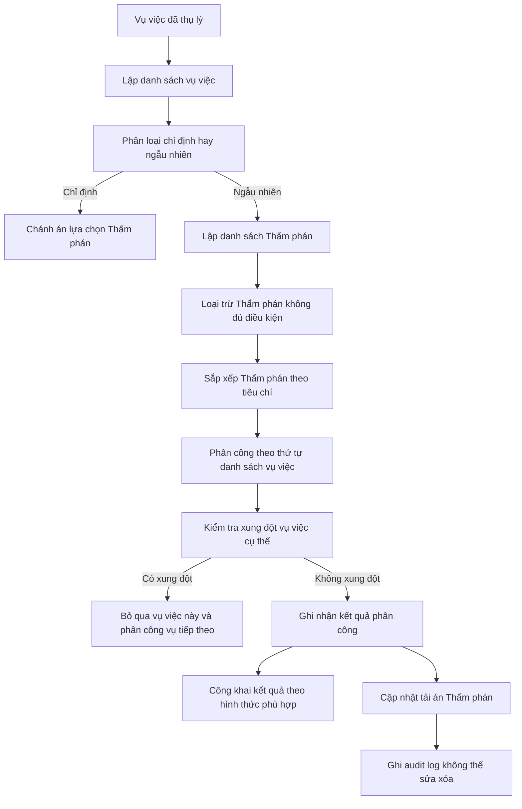
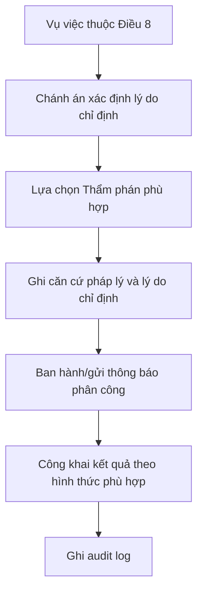

# SKILL_PHAN_CONG_AN_NGAU_NHIEN_V1.md

## 1. Metadata

```yaml
skill_id: RANDOM_CASE_ASSIGNMENT_TAND
skill_name: Phân công án ngẫu nhiên cho Thẩm phán
version: 1.0
legal_source:
  - Thông tư 01/2022/TT-TANDTC ngày 15/12/2022
effective_date: 2023-02-01
domain: Court Case Assignment
applicable_to:
  - vụ án hình sự
  - vụ án hành chính
  - vụ việc dân sự
  - yêu cầu mở thủ tục phá sản
  - đề nghị áp dụng biện pháp xử lý hành chính
  - các vụ việc khác thuộc thẩm quyền của Tòa án
```

---

## 2. Mục tiêu của skill

Skill này giúp AI và hệ thống phần mềm:

1. Lập danh sách vụ việc đã thụ lý chờ phân công.
2. Lập danh sách Thẩm phán đủ điều kiện được phân công.
3. Phân loại vụ việc theo hai phương thức:
   - phân công chỉ định;
   - phân công ngẫu nhiên.
4. Sắp xếp danh sách Thẩm phán theo tiêu chí pháp lý.
5. Phân công án theo trình tự ngẫu nhiên có kiểm soát tải việc.
6. Ghi nhận lý do loại trừ Thẩm phán.
7. Ghi nhật ký toàn bộ quá trình phân công để bảo đảm công khai, minh bạch, không thể can thiệp tùy tiện.
8. Đánh giá công bằng tải án giữa các Thẩm phán.

---

## 3. Khái niệm nghiệp vụ

### 3.1. Phân công giải quyết án

Là việc Chánh án Tòa án quyết định giao hồ sơ vụ việc đã được Tòa án thụ lý cho Thẩm phán giải quyết, xét xử.

### 3.2. Phân công chỉ định

Là việc Chánh án quyết định lựa chọn trực tiếp Thẩm phán để giải quyết, xét xử vụ việc thuộc trường hợp phải chỉ định.

### 3.3. Phân công ngẫu nhiên

Là việc Chánh án quyết định phân công Thẩm phán theo trình tự, tiêu chí và phương pháp ngẫu nhiên quy định tại Thông tư 01/2022/TT-TANDTC.

### 3.4. Danh sách vụ việc

Danh sách các vụ việc đã được Tòa án thụ lý, sắp xếp theo thời gian thụ lý và phân chia theo từng loại vụ án, vụ việc.

### 3.5. Danh sách Thẩm phán

Danh sách các Thẩm phán thuộc trường hợp được phân công giải quyết án sau khi đã loại trừ các trường hợp không đủ điều kiện.

---

## 4. Nguyên tắc phân công

```yaml
principles:
  impartiality:
    description: Vô tư, khách quan, ngẫu nhiên
  fairness:
    description: Công bằng, dân chủ, công khai, hợp lý, kịp thời
  quality:
    description: Bảo đảm chất lượng, hiệu quả xét xử
```

---

## 5. Tiêu chí phân công

```yaml
assignment_criteria:
  - workload_balance:
      description: Số lượng và tính chất phức tạp của vụ việc giữa các Thẩm phán trong năm phải tương đương
  - expertise_match:
      description: Phù hợp chuyên môn, kinh nghiệm xét xử, giải quyết loại vụ việc
  - minor_case_requirement:
      description: Vụ việc có người chưa thành niên phải ưu tiên Thẩm phán đã được đào tạo hoặc có kinh nghiệm liên quan
  - position_match:
      description: Phù hợp vị trí công tác, chức vụ Thẩm phán đang đảm nhiệm
  - specialized_court_priority:
      description: Thẩm phán trong Tòa chuyên trách hoặc Tổ Thẩm phán chuyên trách được ưu tiên án thuộc lĩnh vực đó
  - leadership_quota:
      description: Thẩm phán giữ chức vụ lãnh đạo, quản lý được phân công theo chỉ tiêu TANDTC
  - maternity_quota:
      description: Thẩm phán nữ 03 tháng trước và 03 tháng sau nghỉ thai sản được phân công tối đa 50% so với Thẩm phán khác
```

---

## 6. Trường hợp Thẩm phán không được phân công

```yaml
judge_exclusion_rules:
  - conflict_or_recusal:
      source: Article 5.1
      condition: Thẩm phán thuộc trường hợp phải từ chối tiến hành tố tụng hoặc bị thay đổi đối với vụ việc cụ thể
  - long_absence:
      source: Article 5.2
      condition: Đang biệt phái, công tác, đào tạo, bồi dưỡng, tập huấn từ 01 tháng liên tục trở lên
  - leave_or_health:
      source: Article 5.3
      condition: Nghỉ phép, nghỉ thai sản, nghỉ điều trị bệnh hoặc lý do sức khỏe khác
  - disciplinary_status:
      source: Article 5.4
      condition: Đang bị kỷ luật, chờ xem xét kỷ luật hoặc tạm dừng phân công
  - other_unavailable:
      source: Article 5.5
      condition: Trường hợp khác không thể thực hiện nhiệm vụ
```

---

## 7. Phân loại phương thức phân công

```yaml
assignment_methods:
  designated:
    code: DESIGNATED
    applies_when:
      - vụ án hình sự phức tạp liên quan yêu cầu đấu tranh phòng chống tham nhũng, tiêu cực
      - vụ việc liên quan lợi ích công cộng, lợi ích Nhà nước
      - vụ việc liên quan chính trị, đối ngoại, an ninh, tôn giáo, dân tộc, nhân sĩ, trí thức, dư luận xã hội đặc biệt quan tâm
      - phân công Thẩm phán làm thành viên Hội đồng xét xử
      - đơn giám đốc thẩm, tái thẩm còn dưới 01 tháng hoặc trường hợp đặc biệt
      - thay đổi Thẩm phán theo Điều 11
  random:
    code: RANDOM
    applies_when:
      - vụ việc không thuộc trường hợp phân công chỉ định
```

---

## 8. Quy trình nghiệp vụ tổng thể



---

## 9. Thuật toán sắp xếp danh sách Thẩm phán

### 9.1. Bộ tiêu chí sắp xếp

Thẩm phán được sắp xếp theo thứ tự ưu tiên:

1. Số lượng vụ việc đang được giao giải quyết ít hơn đứng trước.
2. Nếu bằng nhau, Thẩm phán có số vụ việc đang tạm đình chỉ nhiều hơn đứng trước.
3. Nếu tiếp tục bằng nhau, Thẩm phán có số vụ việc quá hạn luật định ít hơn đứng trước.
4. Nếu tiếp tục bằng nhau, Thẩm phán có số vụ việc bị hủy, sửa do nguyên nhân chủ quan trong 01 năm ít hơn đứng trước.
5. Nếu vẫn bằng nhau, sắp xếp theo tên tiếng Việt A, B, C...

### 9.2. Sort key

```yaml
judge_sort_key:
  - active_case_count: ascending
  - suspended_case_count: descending
  - overdue_case_count: ascending
  - subjective_cancel_modify_count_1y: ascending
  - vietnamese_name_order: ascending
```

---

## 10. Thuật toán phân công ngẫu nhiên theo Thông tư

> Lưu ý kỹ thuật: Thông tư dùng thuật ngữ “ngẫu nhiên”, nhưng trình tự Điều 7 và Điều 9 thể hiện mô hình ngẫu nhiên có kiểm soát bằng danh sách đã sắp xếp theo tiêu chí công bằng. Hệ thống cần bảo đảm không cho người dùng sửa kết quả sau khi thuật toán chạy, đồng thời ghi đủ seed/log/phiên phân công.

### 10.1. Input

```yaml
input:
  assignment_batch_id: UUID
  court_id: UUID
  case_list:
    order_by:
      - acceptance_date
      - case_number
    filters:
      - accepted = true
      - not_assigned = true
      - assignment_method = RANDOM
  judge_list:
    filters:
      - is_active = true
      - eligible_for_assignment = true
      - not_excluded_by_article_5 = true
      - belongs_to_compatible_specialized_court = true
```

### 10.2. Output

```yaml
output:
  - case_id
  - assigned_judge_id
  - assignment_method
  - assignment_round
  - sort_rank_at_assignment_time
  - decision_maker_id
  - assignment_timestamp
  - legal_basis
  - audit_hash
```

### 10.3. Pseudocode

```python
def random_case_assignment(case_list, judge_list):
    cases = sort_cases_by_acceptance_time(case_list)

    while cases:
        judges = build_current_eligible_judge_list()
        judges = remove_unavailable_judges(judges)
        judges = sort_judges(
            active_case_count="asc",
            suspended_case_count="desc",
            overdue_case_count="asc",
            subjective_cancel_modify_count_1y="asc",
            vietnamese_name_order="asc",
        )

        for judge in judges:
            if not cases:
                break

            case = cases.pop(0)

            if judge_has_case_specific_conflict(judge, case):
                cases.append(case)
                continue

            create_assignment(case, judge)
            update_judge_workload(judge)
            write_audit_log(case, judge)
```

### 10.4. Cách xử lý xung đột vụ việc cụ thể

Nếu Thẩm phán được chọn thuộc trường hợp phải từ chối tiến hành tố tụng hoặc bị thay đổi đối với vụ việc cụ thể thì không giao vụ đó cho Thẩm phán này; hệ thống chuyển sang vụ việc tiếp theo trong danh sách.

---

## 11. Quy trình phân công chỉ định



### Trường dữ liệu bắt buộc khi chỉ định

```yaml
designated_assignment_required_fields:
  - case_id
  - judge_id
  - decision_maker_id
  - designated_reason_code
  - designated_reason_description
  - legal_basis
  - assignment_date
```

---

## 12. Quy tắc kiểm tra dữ liệu

```yaml
validation_rules:
  R001_NO_CASE_WITHOUT_ACCEPTANCE:
    severity: ERROR
    message: Vụ việc chưa thụ lý không được đưa vào danh sách phân công.
    condition: case.acceptance_date is null

  R002_NO_ASSIGNMENT_WITHOUT_ELIGIBLE_JUDGE:
    severity: ERROR
    message: Không có Thẩm phán đủ điều kiện phân công.
    condition: eligible_judge_count == 0

  R003_EXCLUDE_ABSENT_JUDGE:
    severity: ERROR
    message: Thẩm phán đang vắng mặt dài hạn không được phân công.
    condition: judge.unavailability_type in ['long_absence','training','medical_leave','maternity_leave']

  R004_EXCLUDE_DISCIPLINARY_JUDGE:
    severity: ERROR
    message: Thẩm phán đang bị kỷ luật/chờ kỷ luật/tạm dừng phân công không được phân công.
    condition: judge.disciplinary_status in ['disciplined','pending','suspended']

  R005_CASE_SPECIFIC_CONFLICT:
    severity: ERROR
    message: Thẩm phán thuộc trường hợp phải từ chối hoặc bị thay đổi đối với vụ việc này.
    condition: exists(case_judge_conflict)

  R006_DESIGNATED_REASON_REQUIRED:
    severity: ERROR
    message: Phân công chỉ định phải có lý do và căn cứ pháp lý.
    condition: assignment.method == 'DESIGNATED' and designated_reason_code is null

  R007_RANDOM_ASSIGNMENT_AUDIT_REQUIRED:
    severity: ERROR
    message: Phân công ngẫu nhiên phải có log phiên phân công và dữ liệu xếp hạng tại thời điểm phân công.
    condition: assignment.method == 'RANDOM' and assignment_batch_id is null

  R008_MATERNITY_QUOTA_CHECK:
    severity: WARNING
    message: Thẩm phán nữ trong giai đoạn trước/sau nghỉ thai sản chỉ được phân công tối đa 50% chỉ tiêu.
    condition: judge.maternity_quota_status == true and assigned_case_ratio > 0.5

  R009_LEADERSHIP_QUOTA_CHECK:
    severity: WARNING
    message: Thẩm phán giữ chức vụ lãnh đạo phải được phân công theo chỉ tiêu quy định.
    condition: judge.is_leadership == true and assigned_case_count > leadership_quota
```

---

## 13. Data Dictionary cho phân hệ phân công án

### 13.1. assignment_batches

| Field | Type | Description |
|---|---|---|
| assignment_batch_id | UUID | Mã phiên phân công |
| court_id | UUID | Tòa án thực hiện phân công |
| batch_date | datetime | Thời điểm phân công |
| assignment_method | enum | RANDOM/DESIGNATED/MIXED |
| created_by | UUID | Người tạo phiên |
| decided_by | UUID | Chánh án/Phó Chánh án được ủy quyền |
| status | enum | draft/running/completed/cancelled |
| algorithm_version | string | Phiên bản thuật toán |
| random_seed_hash | string | Hash seed nếu có |
| legal_basis | text | Căn cứ pháp lý |
| public_note | text | Nội dung công khai |

### 13.2. assignment_batch_cases

| Field | Type | Description |
|---|---|---|
| id | UUID | Khóa chính |
| assignment_batch_id | UUID | Phiên phân công |
| case_id | UUID | Vụ việc |
| case_order | integer | Thứ tự trong danh sách vụ việc |
| case_group | string | Loại vụ việc |
| assignment_method | enum | RANDOM/DESIGNATED |
| designated_reason_code | string | Lý do chỉ định nếu có |
| is_assigned | boolean | Đã phân công chưa |

### 13.3. assignment_batch_judges

| Field | Type | Description |
|---|---|---|
| id | UUID | Khóa chính |
| assignment_batch_id | UUID | Phiên phân công |
| judge_id | UUID | Thẩm phán |
| judge_order | integer | Thứ tự sau khi sắp xếp |
| active_case_count | integer | Số vụ đang giải quyết |
| suspended_case_count | integer | Số vụ đang tạm đình chỉ |
| overdue_case_count | integer | Số vụ quá hạn |
| subjective_cancel_modify_count_1y | integer | Số vụ hủy/sửa do nguyên nhân chủ quan trong 01 năm |
| eligible | boolean | Có đủ điều kiện không |
| exclusion_reason | string | Lý do loại trừ |

### 13.4. case_assignments

| Field | Type | Description |
|---|---|---|
| assignment_id | UUID | Khóa chính |
| case_id | UUID | Vụ việc |
| judge_id | UUID | Thẩm phán được phân công |
| assignment_batch_id | UUID | Phiên phân công |
| assignment_role | string | Thẩm phán giải quyết/chủ tọa/thành viên HĐXX |
| assignment_method | enum | RANDOM/DESIGNATED |
| assigned_date | datetime | Ngày phân công |
| assigned_by | UUID | Người quyết định |
| legal_basis | text | Căn cứ pháp lý |
| status | enum | active/replaced/cancelled |
| replacement_reason | text | Lý do thay đổi |

### 13.5. judge_status_periods

| Field | Type | Description |
|---|---|---|
| status_period_id | UUID | Khóa chính |
| judge_id | UUID | Thẩm phán |
| status_type | enum | training/business_trip/leave/maternity/medical/disciplinary/suspended_assignment/other |
| start_date | date | Ngày bắt đầu |
| end_date | date | Ngày kết thúc |
| description | text | Ghi chú |
| decision_document_id | UUID | Văn bản căn cứ |

### 13.6. judge_case_conflicts

| Field | Type | Description |
|---|---|---|
| conflict_id | UUID | Khóa chính |
| case_id | UUID | Vụ việc |
| judge_id | UUID | Thẩm phán |
| conflict_type | string | Lý do từ chối/thay đổi |
| description | text | Mô tả |
| detected_by | UUID | Người/AI phát hiện |
| confirmed_by | UUID | Người xác nhận |
| status | enum | pending/confirmed/rejected |

### 13.7. judge_workload_snapshots

| Field | Type | Description |
|---|---|---|
| snapshot_id | UUID | Khóa chính |
| judge_id | UUID | Thẩm phán |
| court_id | UUID | Tòa án |
| snapshot_date | date | Ngày chốt dữ liệu |
| case_group | string | Nhóm vụ việc |
| active_case_count | integer | Đang giải quyết |
| suspended_case_count | integer | Tạm đình chỉ |
| overdue_case_count | integer | Quá hạn |
| subjective_cancel_modify_count_1y | integer | Hủy/sửa chủ quan 1 năm |
| annual_assigned_count | integer | Được giao trong năm |
| annual_resolved_count | integer | Đã giải quyết trong năm |

---

## 14. Audit và chống can thiệp

Hệ thống phải ghi nhận:

```yaml
audit_requirements:
  - toàn bộ danh sách vụ việc tại thời điểm phân công
  - toàn bộ danh sách Thẩm phán tại thời điểm phân công
  - tiêu chí xếp hạng từng Thẩm phán
  - lý do loại trừ Thẩm phán
  - kết quả phân công
  - người thực hiện
  - người quyết định
  - thời điểm thao tác
  - hash dữ liệu phiên phân công
  - lịch sử thay đổi sau phân công
```

Khuyến nghị dùng cơ chế:

```text
assignment_hash = SHA256(
    batch_id
    + sorted_case_list
    + sorted_judge_list
    + result_assignments
    + timestamp
)
```

---

## 15. Prompt mẫu cho AI Agent

### 15.1. Kiểm tra phiên phân công

```text
Bạn là AI kiểm tra tuân thủ Thông tư 01/2022/TT-TANDTC.
Hãy kiểm tra phiên phân công án {assignment_batch_id}.
Đối chiếu:
1. Danh sách vụ việc đã thụ lý.
2. Danh sách Thẩm phán đủ điều kiện.
3. Tiêu chí loại trừ Điều 5.
4. Tiêu chí sắp xếp Điều 7.
5. Trình tự phân công Điều 9.
6. Trường hợp chỉ định Điều 8.
Kết luận phiên phân công có hợp lệ không, nêu lỗi nếu có.
```

### 15.2. Giải thích kết quả phân công

```text
Hãy giải thích vì sao vụ việc {case_id} được phân công cho Thẩm phán {judge_id}.
Cần nêu:
- phương thức phân công;
- thứ tự vụ việc;
- thứ tự Thẩm phán;
- số vụ đang giải quyết;
- số vụ tạm đình chỉ;
- số vụ quá hạn;
- số vụ bị hủy/sửa chủ quan trong 01 năm;
- căn cứ pháp lý.
```

---

## 16. Output chuẩn cho API phân công

```json
{
  "assignment_batch_id": "uuid",
  "method": "RANDOM",
  "court_id": "uuid",
  "assigned_cases": [
    {
      "case_id": "uuid",
      "case_order": 1,
      "judge_id": "uuid",
      "judge_rank": 1,
      "assignment_reason": "Thẩm phán có số vụ đang giải quyết ít nhất tại thời điểm phân công",
      "legal_basis": "Điều 7, Điều 9 Thông tư 01/2022/TT-TANDTC"
    }
  ],
  "audit": {
    "algorithm_version": "1.0",
    "created_at": "datetime",
    "created_by": "uuid",
    "hash": "sha256"
  }
}
```

---

## 17. Kết luận

Skill này phải được triển khai như một rule engine có audit log chặt chẽ. Trọng tâm không chỉ là “random” theo nghĩa bốc thăm, mà là “phân công tự động theo danh sách được lập và sắp xếp khách quan”, bảo đảm không ai có thể can thiệp vào kết quả sau khi hệ thống chạy.
