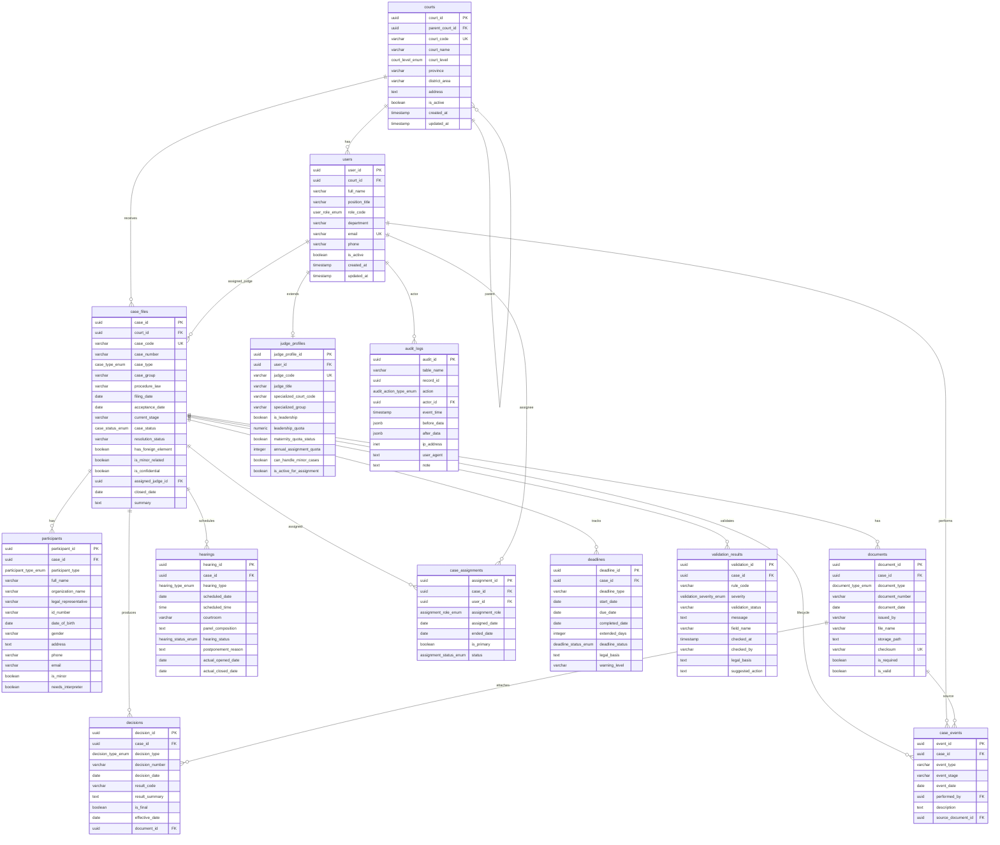

# Core Database Schema ERD

## Notes

- The core uses PostgreSQL enums for stable operational states and roles because these values are used in constraints, partial indexes, and validation paths.
- `dm_categories` and `dm_category_items` are included as a minimal reference-data foundation for later business-specific catalogs, without expanding this core task into detailed legal/statistical catalogs.
- Random assignment batches, appeal/protest tracking, statistics/KPI formulas, and specialized case detail tables are intentionally outside this ERD.
