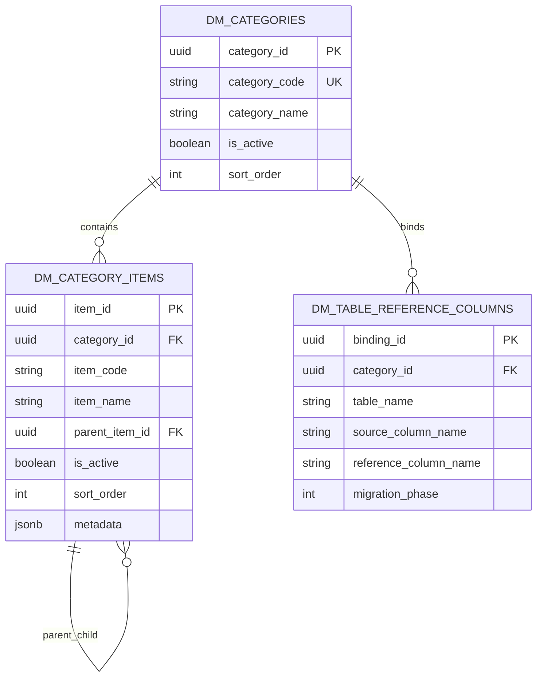
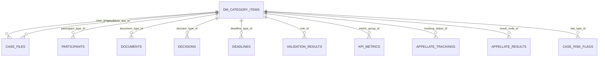

# DATABASE REFERENCE DATA ERD TASK 03

## Mô hình danh mục tổng quát

## Quan hệ 1-n sang bảng nghiệp vụ

Task 03 thêm FK nullable đến `dm_category_items` để không phá dữ liệu cũ. Tầng ứng dụng hoặc task backfill sau sẽ bảo đảm item thuộc đúng category theo mapping trong `dm_table_reference_columns`.

## Nhóm danh mục ưu tiên

- Hồ sơ: `case_group`, `procedure_law`, `case_stage`, `case_status`.
- Đương sự/tài liệu/quyết định: `participant_type`, `document_type`, `decision_type`.
- Deadline/validation: `deadline_type`, `deadline_status`, `warning_level`, `validation_rule`, `validation_status`.
- Thống kê/KPI: `period_type`, `aggregation_level`, `statistic_form`, `kpi_group`.
- Phân công: `assignment_role`, `assignment_method`, `assignment_status`.
- Cấp trên: `appeal_protest_type`, `tracking_status`, `appellate_result`, `fault_classification`, `fault_reason_group`.
- AI/audit: `risk_type`, `ai_suggestion_type`, `audit_action`.
