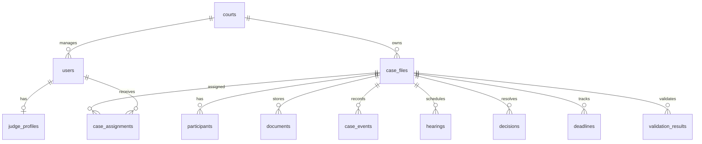
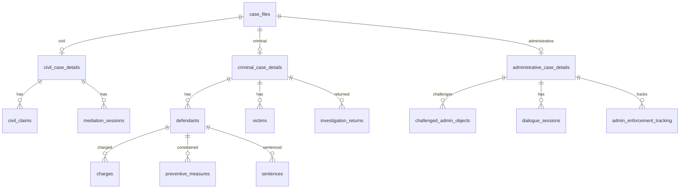
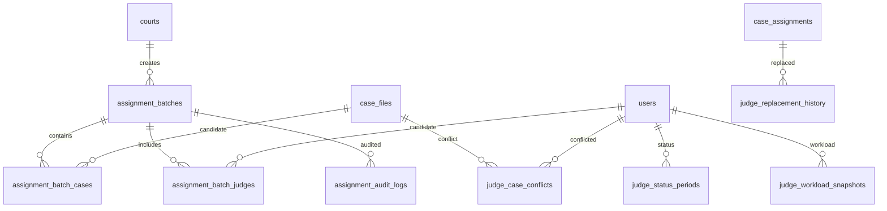
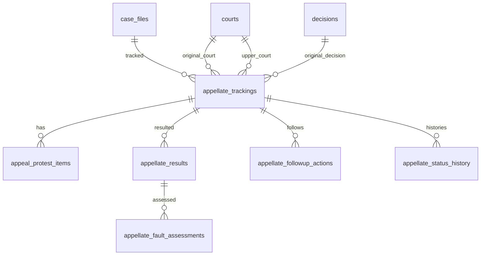
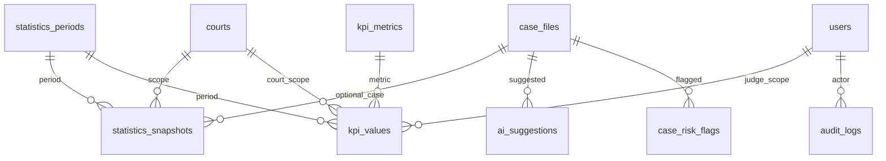

# Rà soát quan hệ database Task 02

## Luồng quan hệ chính

Core case đã có quan hệ nền tảng hợp lý: hồ sơ thuộc tòa, người dùng thuộc tòa, hồ sơ có đương sự, tài liệu, sự kiện, phân công, phiên xử, quyết định, hạn và kết quả kiểm tra rule. Migration 002 bổ sung khóa chống trùng cho số vụ án theo tòa/loại án, phân công thẩm phán chính active, tài liệu cùng số văn bản và validation đang mở.

## Module án chuyên biệt

Mỗi loại án chuyên biệt đang dùng quan hệ 1-1 với `case_files` qua bảng detail, sau đó tách các danh sách con. Đây là thiết kế phù hợp để tránh nhồi mọi trường vào bảng hồ sơ lõi. Migration 002 thêm chống trùng ở các danh sách con có định danh rõ: yêu cầu dân sự theo bên, phiên hòa giải theo ngày, bị cáo theo họ tên/ngày sinh, tội danh theo điều khoản, đối tượng hành chính theo số văn bản.

## Phân công án ngẫu nhiên

Thiết kế đã tách batch, danh sách án, danh sách thẩm phán, trạng thái, tải công việc, xung đột và audit. Migration 002 bổ sung khóa chống trùng integrity hash, thứ tự thẩm phán trong batch, trạng thái bắt đầu của thẩm phán, workload snapshot có `case_group` NULL, conflict type NULL và lịch sử thay thế.

## Phúc thẩm, kháng cáo, kháng nghị

Quan hệ module phúc thẩm đã đủ để theo dõi từ hồ sơ gốc, quyết định gốc, nội dung kháng cáo/kháng nghị, kết quả cấp trên, đánh giá lỗi, hành động theo dõi và lịch sử trạng thái. Migration 002 chặn `appeal_protest_items.item_type = BOTH` ở từng item, vì `BOTH` chỉ phù hợp ở tracking tổng hợp; item cụ thể phải là kháng cáo hoặc kháng nghị. Ràng buộc lỗi chủ quan phải có nhóm lý do được thêm ở cấp database.

## Thống kê, KPI, AI và audit

Các bảng thống kê/KPI đang tách kỳ, chỉ tiêu và giá trị. Migration 002 thêm khóa chống trùng theo scope để ngăn một chỉ tiêu bị ghi lặp trong cùng kỳ/tòa/thẩm phán/hồ sơ. Lớp AI/rule giữ vai trò gợi ý, cảnh báo và audit; không thay thế quyết định nghiệp vụ.

## Quan hệ cần cân nhắc ở task sau

- `judge_status_periods` nên có exclusion constraint theo khoảng thời gian để chặn hai trạng thái active chồng lấn của cùng thẩm phán.
- `statistics_snapshots` nếu cần lưu lịch sử nhiều lần tính lại thì cần thêm version hoặc trạng thái hiệu lực.
- Các cột trạng thái dạng text nên chuyển dần sang enum/bảng danh mục sau khi chốt bộ giá trị chuẩn.
