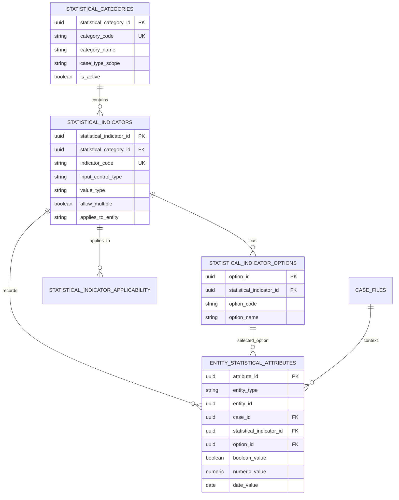
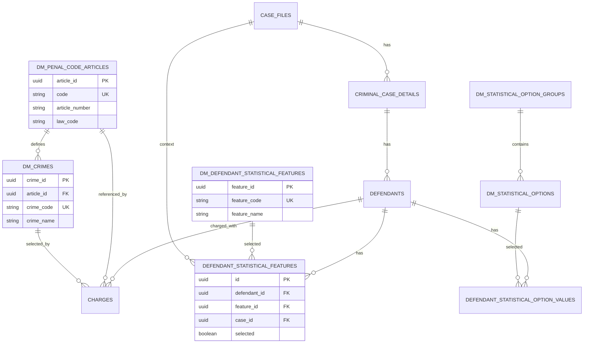
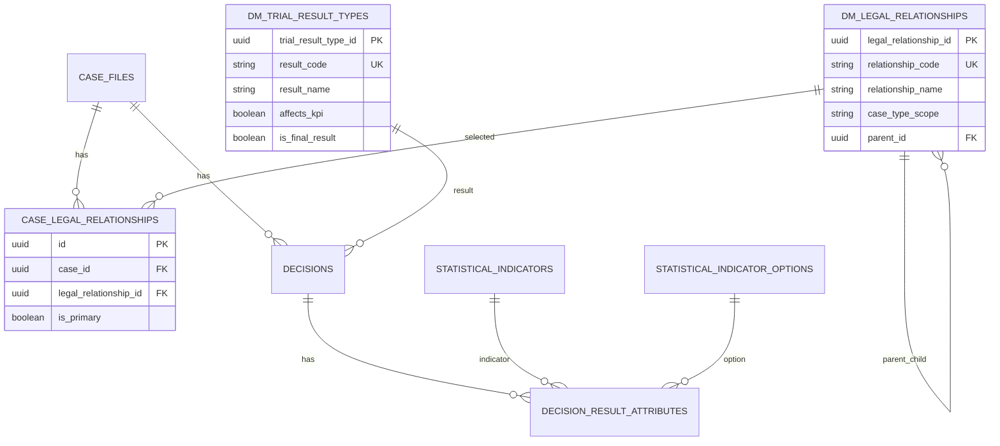
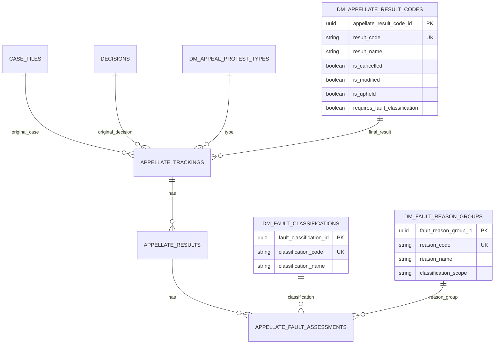
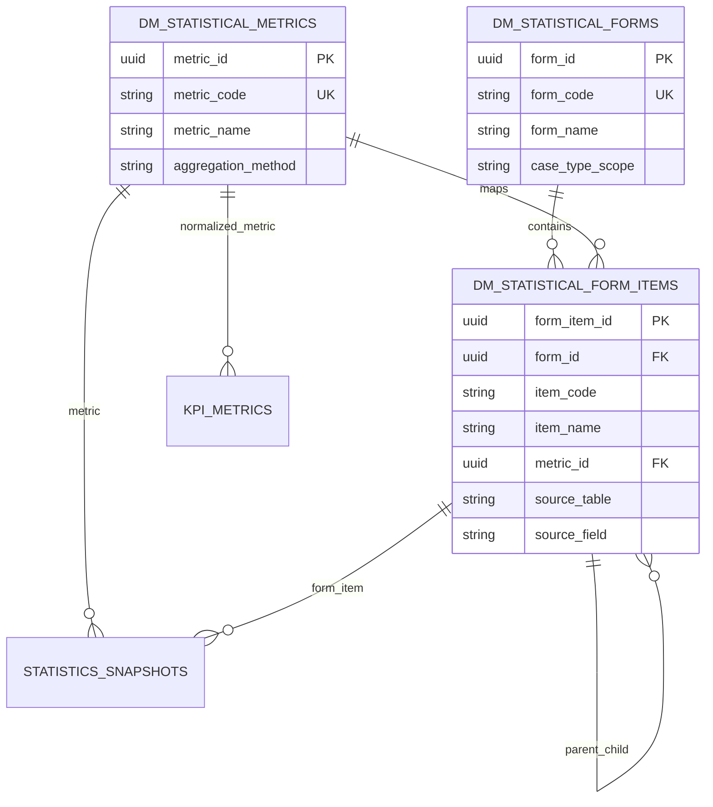

# STATISTICAL REFERENCE DATA ERD

ERD này mô tả lớp danh mục thống kê bổ sung ở migration 004. Các cột text/code cũ vẫn được giữ để migration an toàn và phục vụ backfill.

## Ghi chú thiết kế

- `entity_statistical_attributes` phục vụ model tổng quát cho dropdown/radio/checkbox/numeric/date khi chưa cần bảng chuyên biệt.
- Bảng chuyên biệt được dùng cho tội danh, đặc điểm bị cáo, quan hệ pháp luật, kết quả xét xử, kết quả cấp trên và chỉ tiêu thống kê/KPI vì các nhóm này có giá trị nghiệp vụ cao.
- `case_legal_relationships` và `defendant_statistical_features` là quan hệ n-n để tránh nối chuỗi hoặc đếm trùng.
- `statistics_snapshots` là snapshot lịch sử; chỉ nên dùng để lưu kết quả tổng hợp sau khi dữ liệu nguồn đã chuẩn hóa.
